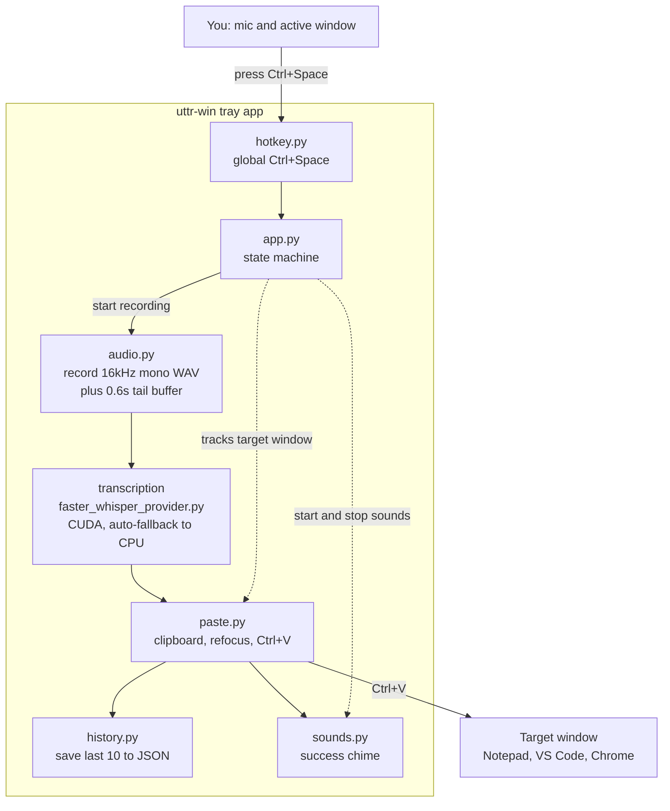
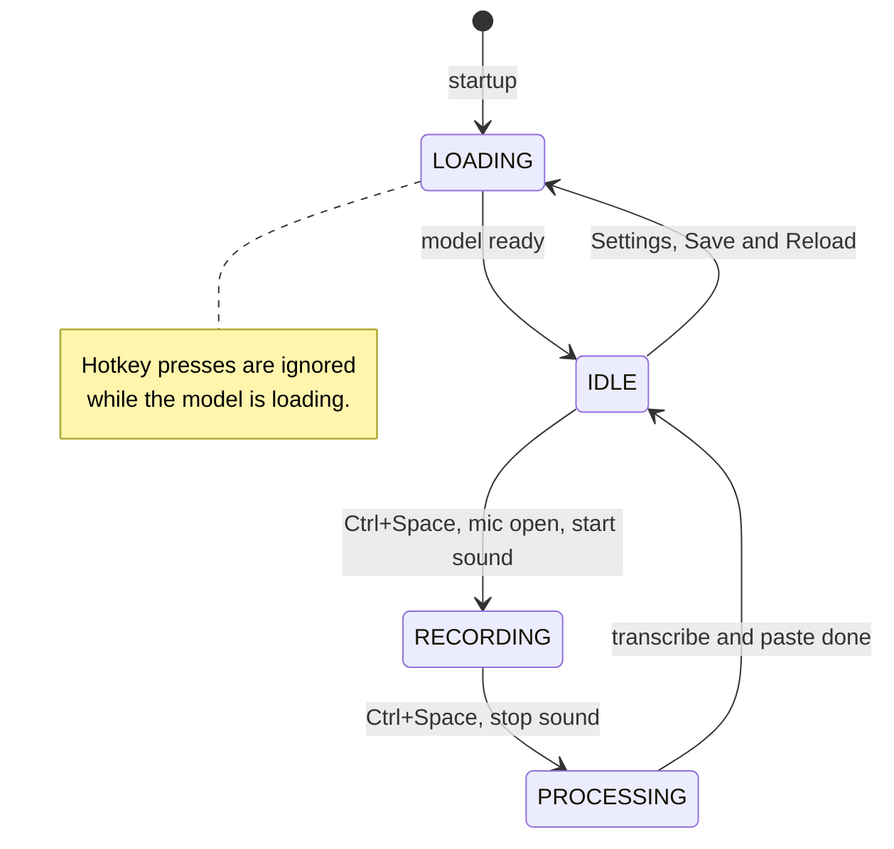
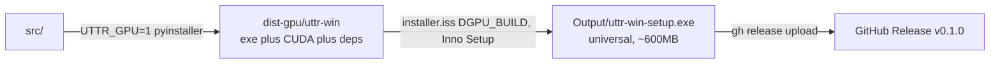

# uttr-win — Architecture

A high-level map of how speech becomes pasted text. Read this first if you're
trying to understand "what does what" without diving into every file.

## The one-sentence version

You press **Ctrl+Space**, speak, press **Ctrl+Space** again — the app records your
mic, runs it through a local Whisper model on your GPU/CPU, and pastes the
resulting text into whatever window your cursor was in.

## End-to-end flow

> The diagrams below are [Mermaid](https://mermaid.js.org/). GitHub renders them
> as interactive diagrams — click one to open the viewer and **zoom / pan**.

## The state machine (app.py)

The whole app is driven by four states. Each Ctrl+Space press moves it forward.

## Who does what (file responsibilities)

| File | Responsibility |
|------|----------------|
| `launcher.py` | PyInstaller entry point. Just calls `uttr_win.app.main()`. Exists because PyInstaller can't run a module with relative imports directly. |
| `app.py` | **The brain.** Owns the tray icon + menu (History/Settings/Quit), the IDLE→RECORDING→PROCESSING state machine, the main-thread tkinter root, and the UI queue that marshals tray clicks onto the main thread. Wires every other module together. |
| `hotkey.py` | Registers the global **Ctrl+Space** hotkey via Win32 `RegisterHotKey` and fires a callback on each press. |
| `audio.py` | Opens the mic (`sounddevice`), buffers frames, writes a temp 16kHz mono WAV. Adds a 0.6s tail so the last word isn't clipped. |
| `transcription/base.py` | Abstract `TranscriptionProvider` — the contract every backend implements (`prepare`, `transcribe`, `name`, `is_ready`). |
| `transcription/factory.py` | Picks a provider by id from settings (`faster-whisper` default). |
| `transcription/faster_whisper_provider.py` | The real STT engine. Auto-detects CUDA vs CPU by free VRAM, loads the Whisper model, transcribes the WAV. Handles the frozen-exe symlink workaround (see PROJECT_LOG). |
| `transcription/onnx_parakeet_provider.py`, `nemo_parakeet_provider.py` | Alternative backends (stubs / not default). |
| `paste.py` | Clipboard + focus + `Ctrl+V` injection. Tracks the foreground window so it knows *where* to paste. Releases stray modifier keys before pasting. |
| `sounds.py` | Plays start / stop / success / error WAVs via `winsound`. |
| `history.py` | Appends each transcription to `history.json` (keeps last 10). |
| `settings.py` | Loads/saves `settings.yaml`, holds defaults (model, device, hotkey label, etc.). |
| `ui/settings_window.py` | Settings `Toplevel` (device, model size, sounds, autostart, GPU status) — a child of the shared root, built on the main thread. |
| `ui/history_window.py` | History `Toplevel` listing recent transcriptions with Copy buttons — also a child of the shared root. |
| `logger.py` | Central logging to `%LOCALAPPDATA%\uttr-win\logs\uttr.log`. |
| `gpu_setup.py` | GPU detection + (source-install) CUDA package installer used by the settings GPU panel. |

## Where things live at runtime

| Path | What |
|------|------|
| `%LOCALAPPDATA%\uttr-win\logs\uttr.log` | Runtime log — **first place to look when something breaks.** |
| `%LOCALAPPDATA%\uttr-win\settings.yaml` | Saved settings. |
| `%LOCALAPPDATA%\uttr-win\history.json` | Transcription history. |
| `%LOCALAPPDATA%\uttr-win\models-local\<size>\` | Flat (symlink-free) model copy used by the installed .exe. |
| `~\.cache\huggingface\hub\` | Model cache used when running from Python source (dev mode). |

## Threading model (why it stays responsive)

tkinter is not thread-safe, so **tkinter owns the main thread**: one hidden
`Tk()` root lives for the app's whole lifetime, and the Settings/History windows
are `Toplevel`s of it. Everything else runs off the main thread:

- **Tray icon (pystray)** — runs in its own background thread. Its menu
  callbacks never touch tkinter; they push a token onto a `queue.Queue`.
- **UI queue pump** — the main thread polls that queue via `root.after(100ms)`
  and creates/raises windows there, so *all* tkinter work happens on one thread.
- **Hotkey listener** — its own thread running a Win32 message loop.
- **Foreground tracker** — polls the active window every 100ms on its own thread.
- **Model load** — daemon thread at startup (and on Settings → Save & Reload).
- **Transcription** — daemon thread per recording, with a watchdog thread that
  resets state if it hangs > 120s.

> This replaced an earlier design where each window spawned its own `Tk()` in a
> background thread — that intermittently segfaulted the whole process and froze
> the tray (see PROJECT_LOG bug #9).

## Build & distribution flow

A single **universal installer** is published: the GPU build (CUDA bundled) that
auto-selects GPU or CPU at runtime. `UTTR_GPU=1` at PyInstaller time picks which
CUDA DLLs to bundle; `/DGPU_BUILD` at Inno Setup time picks the dist folder and
output name. A smaller CPU-only build (plain `pyinstaller` + `iscc` → output
`uttr-win-cpu-setup.exe`) exists but is **not published**.
