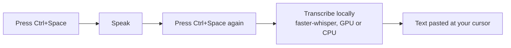
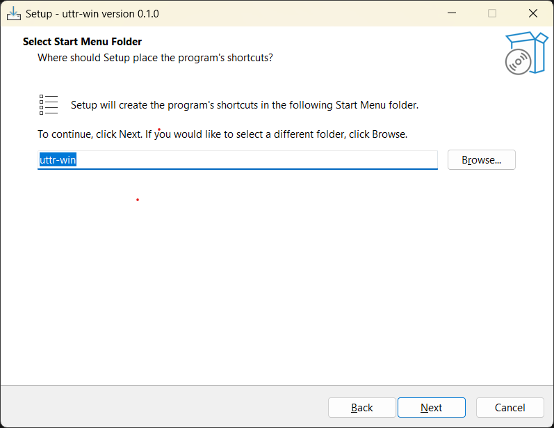
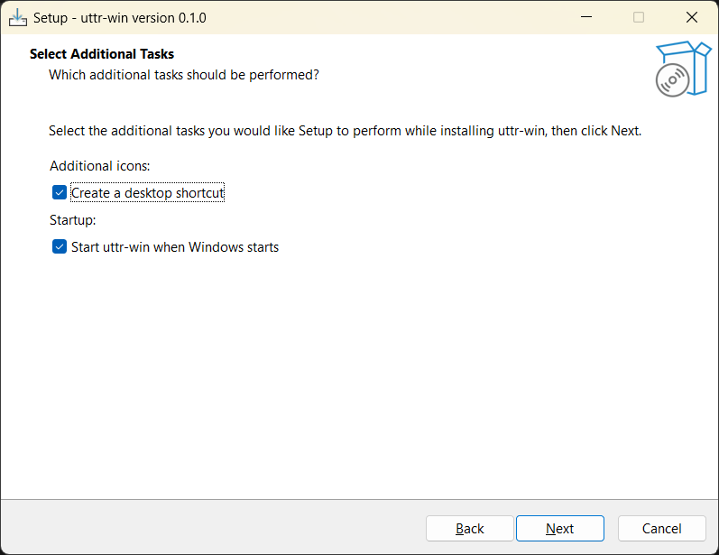
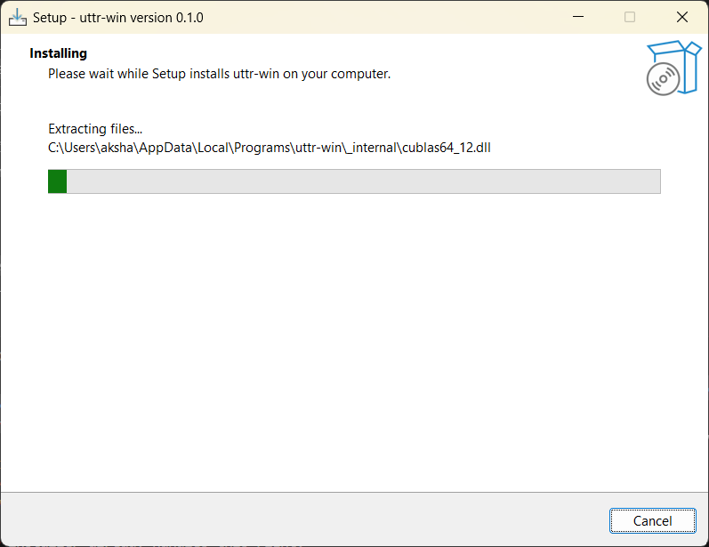
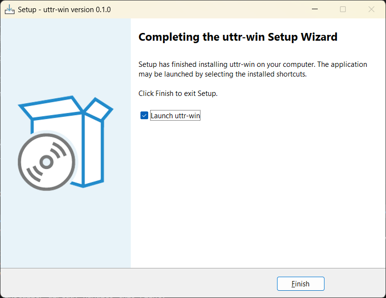
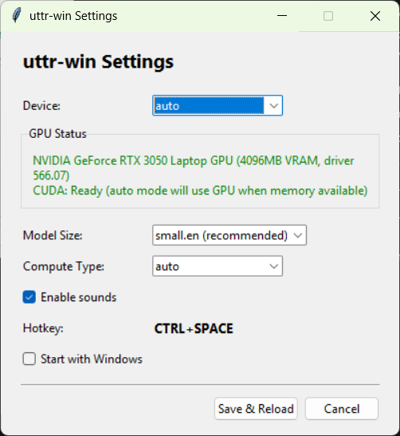

# uttr-win

Local speech-to-text for Windows. Press a hotkey, speak, text appears at your cursor. No cloud, no subscription.

## How it works



> This diagram is [Mermaid](https://mermaid.js.org/) — on GitHub you can click it
> to zoom and pan. Deeper internals are in [ARCHITECTURE.md](ARCHITECTURE.md).

## System Requirements

| Requirement | Details |
|-------------|---------|
| **OS** | Windows 10 (version 1903+) or Windows 11 — x64 only (ARM64 not supported) |
| **CPU** | Any modern x64 processor (Intel/AMD). Transcription runs on CPU by default. |
| **RAM** | 4 GB minimum, 8 GB recommended |
| **Disk** | ~600 MB (installer) |
| **GPU** (optional) | NVIDIA GPU with compute capability 7.0+ (GTX 1650 or newer, any RTX) and driver 525+. Not required — CPU works fine, just slower. |
| **Audio** | Working microphone |

## Installation (Recommended)

Download **`uttr-win-setup.exe`** from the [Releases](https://github.com/SanjuEpic/free-wispr-flow/releases) page — one universal installer for every Windows 10/11 x64 PC (~600 MB):

| Installer | Works on | Size |
|-----------|----------|------|
| `uttr-win-setup.exe` | Any Windows 10/11 x64 PC — uses your NVIDIA GPU automatically if present, otherwise runs on CPU | ~600 MB |

It bundles CUDA, so NVIDIA GPU users get fast inference out of the box, and it **falls back to CPU automatically** on machines without an NVIDIA GPU — no separate download, nothing to configure. The installer is larger because the CUDA libraries are included; if you specifically want a smaller CPU-only build, you can build one from source (see [Building the Installer](#building-the-installer)).

### Install Steps

1. Download `uttr-win-setup.exe`.
2. Run the installer — Windows SmartScreen may warn "unrecognized app". Click **More info** → **Run anyway** (the app is unsigned).
3. Choose the Start Menu folder (default `uttr-win` is fine) and click **Next**. The default install location is `%LOCALAPPDATA%\Programs\uttr-win` (per-user, no admin needed).

   

4. Pick the additional tasks. **Create a desktop shortcut** gives you a launch icon; **Start uttr-win when Windows starts** makes it auto-launch on every boot/restart. Both are optional — check what you prefer, then click **Next**.

   

5. Click **Install** and wait while files extract (the bundled CUDA libraries make this take a bit longer).

   

6. Leave **Launch uttr-win** checked and click **Finish**.

   

The first launch downloads the speech model (~500 MB for `small.en`). After that, everything runs fully offline.

### After Install — finding and launching the app

uttr-win has **no main window** — it lives in your system tray (bottom-right, near the clock). When it's ready you'll see a notification: *"Ready! Press Ctrl+Space to start recording."*

- **The tray icon:** click the `^` (show hidden icons) arrow near the clock to find the uttr-win feather icon. **Right-click it** for the menu: **History**, **Settings**, **Quit**.

  

- **To relaunch after closing it (or after restarting Windows):** double-click the **uttr-win desktop shortcut** (if you created one), or find **uttr-win** in the Start Menu. It will spin back up into the tray. If you enabled *"Start uttr-win when Windows starts"*, it launches automatically on every boot — no action needed.
- **To confirm it's running:** the tray icon is present and the *"Ready!"* notification appeared. Then just press **Ctrl+Space** in any text field to dictate.

### Uninstall

Control Panel → Programs → Uninstall → uttr-win. Or run the uninstaller from Start Menu → uttr-win → Uninstall.

## Installation (From Source)

**Requirements:** Python 3.11 or 3.12 (3.13 works for faster-whisper but NeMo/ONNX Parakeet need PyTorch which doesn't support 3.13)

```
git clone https://github.com/SanjuEpic/free-wispr-flow.git
cd free-wispr-flow
pip install -e .
python -m uttr_win.app
```

Or run with a specific model size:
```
python -m uttr_win.app -size small.en           # default, good balance
python -m uttr_win.app -size tiny.en            # fastest, lower accuracy
python -m uttr_win.app -size medium.en          # higher accuracy, slower
python -m uttr_win.app -size distil-large-v3    # best speed+accuracy ratio
```

Available `-size` options: `tiny.en`, `base.en`, `small.en`, `medium.en`, `distil-medium.en`, `distil-large-v3`, `large-v3-turbo`

## Usage

1. Launch uttr-win — an icon appears in your system tray
2. **Ctrl+Space** to start recording — a sound plays to confirm
3. **Ctrl+Space** again to stop recording and transcribe
4. Transcribed text is pasted at your cursor position in any app
5. Right-click the tray icon → **History** to view and copy recent transcriptions
6. Right-click the tray icon → **Settings** to configure model, device, sounds, etc.
7. Right-click the tray icon → **Quit** to exit

## Settings

Right-click the tray icon → **Settings** to open the settings window:

| Setting | Options | Default |
|---------|---------|---------|
| Device | auto / cpu / cuda | auto (picks GPU if enough VRAM, else CPU) |
| Model Size | tiny.en through large-v3-turbo | small.en |
| Compute Type | auto / float16 / int8 | auto (float16 on GPU, int8 on CPU) |
| Sounds | on / off | on |
| Start with Windows | on / off | off |

Changes take effect after clicking **Save & Reload** — the transcription model reloads without restarting the app.

Settings are stored at `%LOCALAPPDATA%/uttr-win/settings.yaml`.

## GPU Acceleration (NVIDIA CUDA)

CUDA dramatically improves transcription speed — `small.en` drops from ~5s to ~2s on a typical NVIDIA GPU.

### If you installed the app (.exe)

GPU support is built in and works out of the box — no separate variant needed. The app auto-detects your hardware and switches between CPU/GPU based on available VRAM. On a machine without an NVIDIA GPU it simply runs on CPU; the installer never breaks. You can also force a specific device in Settings:

- **auto** (default) — uses GPU when enough VRAM is free, otherwise falls back to CPU
- **cpu** — always uses CPU
- **cuda** — always uses GPU (falls back to CPU if GPU load fails)

### If you installed from source

You can enable GPU support by installing the CUDA libraries:

```
pip install nvidia-cublas-cu12 nvidia-cudnn-cu12
pip install ctranslate2 --force-reinstall
```

Or open **Settings** from the tray icon — the **GPU Status** panel has an **Install GPU Support** button that does this automatically.

Verify CUDA is working:
```
python -c "import ctranslate2; print(ctranslate2.get_supported_compute_types('cuda'))"
```
You should see `float16`, `int8_float16`, etc. in the output.

**Without CUDA:** Everything works on CPU automatically — just slower.

### Benchmark Reference (CPU vs GPU)

Tested with `small.en` on a 15-second audio clip:

| Device | Compute Type | Latency |
|--------|-------------|---------|
| CPU (12-core) | int8 | ~5-7s |
| RTX 3050 4GB | float16 | ~2s |

## Building the Installer

To build the installer yourself:

```
pip install pyinstaller

# Universal build (CUDA bundled, auto CPU/GPU at runtime) — this is what's published
set UTTR_GPU=1
pyinstaller uttr-win.spec --distpath dist-gpu --workpath build-gpu
iscc installer.iss /DGPU_BUILD          # -> Output/uttr-win-setup.exe (~600 MB)

# Optional smaller CPU-only build (no CUDA, not published)
pyinstaller uttr-win.spec
iscc installer.iss                      # -> Output/uttr-win-cpu-setup.exe (~96 MB)
```

[Inno Setup](https://jrsoftware.org/issetup.php) must be installed and `iscc` on your PATH (pass `/DGPU_BUILD` via PowerShell). The output installer lands in the `Output/` directory.

## Installing Optional Providers

**NeMo Parakeet** (requires Python 3.12 or lower — PyTorch does not support 3.13):
```
pip install uttr-win[nemo]
```

**ONNX Parakeet:**
```
pip install uttr-win[onnx]       # CPU
pip install uttr-win[onnx-gpu]   # NVIDIA GPU
```

## Troubleshooting

### Windows SmartScreen blocks the installer

The installer is not code-signed. Click **More info** → **Run anyway**. This is normal for unsigned open-source software.

### `cublas64_12.dll not found` at runtime

The CUDA DLLs are installed but not on PATH. The app handles this automatically, but if you hit this error from source:
```
python -c "import nvidia.cublas, os; print([p for p in nvidia.cublas.__path__])"
```
Add the `bin` subfolder of that path to your system PATH, then restart your terminal.

### Hotkey not working

- Make sure no other app is using **Ctrl+Space**
- Check the log at `%LOCALAPPDATA%/uttr-win/logs/uttr.log` for registration errors
- Some IDEs use Ctrl+Space for autocomplete — it will still toggle recording, but the IDE popup may also appear

### Text not pasting at cursor

- Click into the target app (Notepad, browser, etc.) before pressing the hotkey
- uttr-win tracks the last active window and restores focus before pasting
- Some apps with elevated privileges may block paste from non-elevated processes — try running uttr-win as administrator

### `editdistance` fails to build when installing NeMo

This C extension needs a compiler:
```
winget install Microsoft.VisualStudio.2022.BuildTools --override "--add Microsoft.VisualStudio.Workload.VCTools --passive --wait"
```
Or use a pure-Python alternative:
```
pip install editdistance-s rapidfuzz
pip install "nemo-toolkit[asr]>=1.22"
```

### PyTorch not found / no matching distribution

PyTorch requires Python 3.12 or lower:
```
py -3.12 -m venv .venv
.venv\Scripts\activate
pip install -e .
```

## Benchmarking

Record voice samples and benchmark all faster-whisper model sizes:

```
python benchmarks/record_samples.py
python benchmarks/benchmark_providers.py --providers fw
```

Test specific sizes:
```
python benchmarks/benchmark_providers.py --providers fw --sizes small.en,medium.en,distil-large-v3
```

## License

MIT
